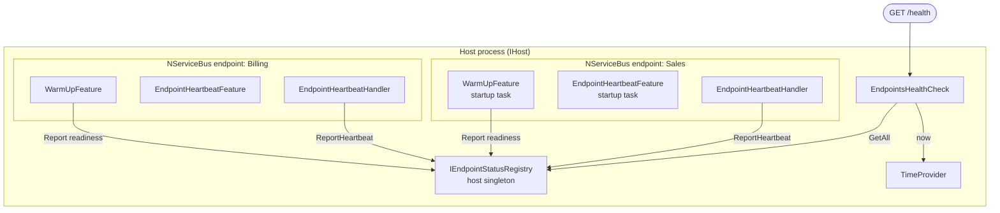
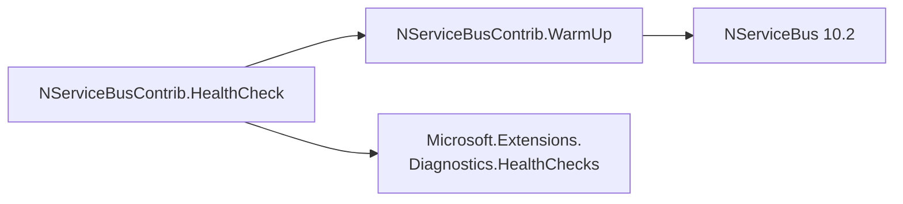

# Architecture

Two related add-ons that work together to make an NServiceBus host behave well in
a container:

- **NServiceBusContrib.WarmUp** — block message processing until user-defined
  warm-up actions complete.
- **NServiceBusContrib.HealthCheck** — expose a single `/health` endpoint that
  aggregates the readiness (and liveness) of every NServiceBus endpoint in the
  process.

Origin: [forum thread on executing warm-up/start-up tasks before message
processing begins](https://discuss.particular.net/t/executing-warm-up-start-up-tasks-healthchecks-before-message-processing-begins/4586).

## Problem

1. **Latency-sensitive handlers.** Caches, connection pools, and JIT paths should
   be primed *before* the endpoint starts pulling messages, so the first real
   message doesn't pay the cold-start cost.
2. **Container health.** Docker/Kubernetes want a `/health` URL to gate traffic
   and detect crashes. Since NServiceBus 10.2 a single process can host
   **multiple** endpoints (`AddNServiceBusEndpoint`); if one endpoint faults while
   the others keep running, the single `/health` must reflect that.

## How the pieces fit

Every endpoint in a multi-endpoint host gets its own *scoped* container built on
top of the host's services, so host **singletons are shared**. That is the key
enabler: one `IEndpointStatusRegistry` singleton sees every endpoint, and one
health check can aggregate them.

## Package boundaries

`WarmUp` has no web or health-check dependencies. `HealthCheck` depends on
`WarmUp` (the status registry lives there) plus the ASP.NET Core health-check
abstractions. The dependency only ever points one way.

The shared state both packages touch is `IEndpointStatusRegistry` (in `WarmUp`):
`WarmUp` writes readiness, `HealthCheck` writes heartbeats and reads everything.

| Concern | Lives in | Detail |
| ------- | -------- | ------ |
| Readiness (warm-up gating) | WarmUp | [warmup.md](warmup.md) |
| Status registry | WarmUp | `IEndpointStatusRegistry` singleton |
| Liveness (heartbeat) | HealthCheck | [healthcheck.md](healthcheck.md) |
| `/health` aggregation | HealthCheck | [healthcheck.md](healthcheck.md) |

## Status / phasing

- **Phase 1** — warm-up feature, readiness registry, aggregate `/health`.
- **Phase 2** — heartbeat liveness (stale heartbeat ⇒ unhealthy even without a
  clean stop).
- **Phase 3** — readiness vs liveness split via health-check tags, so a
  warming-up endpoint is reported alive-but-not-ready (`/health/ready` +
  `/health/live`, mapping onto Docker `--start-period` and the Kubernetes
  startup/readiness/liveness probes). See [healthcheck.md](healthcheck.md).
