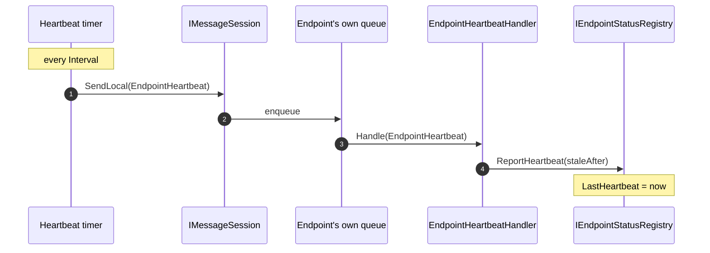

# NServiceBusContrib.HealthCheck

Aggregates the status of every NServiceBus endpoint in the process into a single
ASP.NET Core health check, suitable for a container `/health` endpoint.

## Registration

```csharp
builder.Services
    .AddHealthChecks()
    .AddNServiceBusEndpoints();   // reads IEndpointStatusRegistry

// map it the standard ASP.NET way
app.MapHealthChecks("/health");
```

## What "healthy" means

The check reads a snapshot of all endpoints from the registry and evaluates each:


- **Healthy** — every endpoint is `Ready` and, where heartbeat liveness is
  enabled, has a fresh heartbeat.
- **Unhealthy** — at least one endpoint is `Starting`/`Stopped`, or its heartbeat
  is stale. Docker keeps the container out of rotation until all endpoints are
  warm and live.
- The result `data` carries a per-endpoint breakdown (`Ready`, `Starting`,
  `Stopped`, or `Stale`) so the cause is visible.

Staleness is evaluated against an injectable `TimeProvider`, so it is unit
testable.

## Heartbeat liveness

Readiness alone can't catch a process that hangs or a pump that dies without a
clean stop — `OnStop` never fires, so the endpoint would keep reporting `Ready`.
Heartbeat liveness closes that gap.

```csharp
endpointConfiguration.EnableEndpointHeartbeat(heartbeat =>
{
    heartbeat.Interval = TimeSpan.FromSeconds(15);    // how often a heartbeat is sent
    heartbeat.StaleAfter = TimeSpan.FromSeconds(45);  // defaults to 3 * Interval
});
```

A `FeatureStartupTask` seeds an initial heartbeat at start and then periodically
sends an `EndpointHeartbeat` to the endpoint's **own** queue. Only the handler
*processing* that message refreshes the timestamp, so it stays fresh only while
the pump is genuinely working.



If the pump stalls, no heartbeat is processed, the timestamp ages past
`StaleAfter`, and the health check reports the endpoint unhealthy.

## Handler registration ([Handler] / source generation)

`EndpointHeartbeatHandler` is a NServiceBus 10.2 `[Handler]` POCO: it does **not**
implement `IHandleMessages<T>`, so assembly scanning never discovers it. The
NServiceBus source generator emits an adapter plus a C# interceptor that rewrites
the package's `endpointConfiguration.AddHandler<EndpointHeartbeatHandler>()` call
into the generated, trim-safe registration (which also registers the message
type). Registering it explicitly means heartbeats work regardless of the user's
scanning setting, with no risk of double registration. `EndpointHeartbeat` itself
is a plain POCO — the generator registers it as a message, so no `IMessage` marker
is needed.
