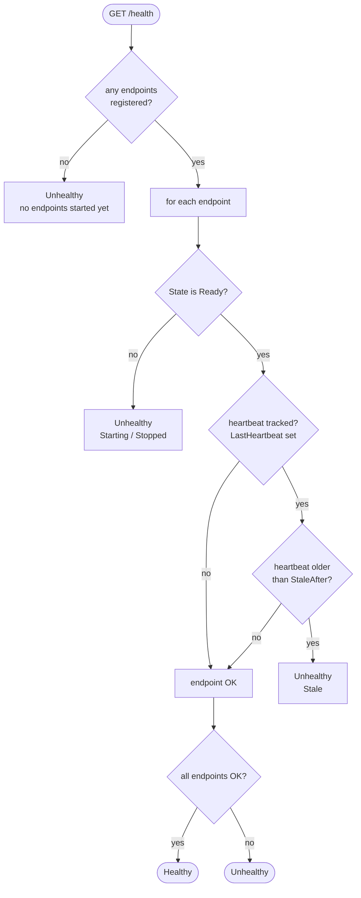
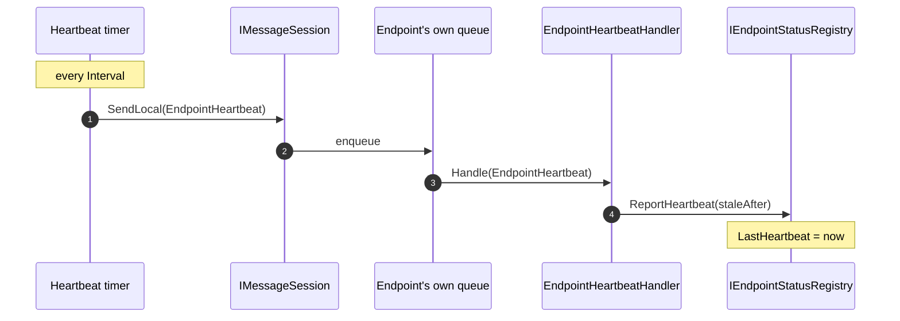

# NServiceBusContrib.HealthCheck

Aggregates the status of every NServiceBus endpoint in the process into ASP.NET
Core health checks, suitable for container `/health` probes.

## Registration

For a single `/health` URL (e.g. plain Docker with one `HEALTHCHECK`):

```csharp
builder.Services
    .AddHealthChecks()
    .AddNServiceBusEndpoints();   // reads IEndpointStatusRegistry

app.MapHealthChecks("/health");
```

For the Docker/Kubernetes probe model, register the readiness and liveness checks
and map them to separate URLs by tag:

```csharp
builder.Services
    .AddHealthChecks()
    .AddNServiceBusEndpointsReadiness()   // tag: "ready"
    .AddNServiceBusEndpointsLiveness();   // tag: "live"

app.MapHealthChecks("/health/ready", new HealthCheckOptions
{
    Predicate = r => r.Tags.Contains("ready")
});
app.MapHealthChecks("/health/live", new HealthCheckOptions
{
    Predicate = r => r.Tags.Contains("live")
});
```

## Readiness vs liveness

The two checks answer different questions, and `Starting` (warming up) is the
only endpoint state where they differ — that difference is the whole point:

| Endpoint state           | `/health/ready` | `/health/live` |
| ------------------------ | --------------- | -------------- |
| not started yet          | Unhealthy       | Healthy        |
| **Starting** (warm-up)   | Unhealthy       | **Healthy**    |
| Ready, fresh heartbeat   | Healthy         | Healthy        |
| Ready, stale heartbeat   | Unhealthy       | Unhealthy      |
| Stopped / crashed        | Unhealthy       | Unhealthy      |

- **Readiness** — "has it finished starting and can it serve?" Gates traffic.
- **Liveness** — "is it alive, or should it be restarted?" A warming-up endpoint
  is alive, so liveness stays healthy during warm-up and only fails on a real
  crash (`Stopped`) or a stalled pump (stale heartbeat). An empty registry
  (nothing started yet) is alive too — so a liveness probe never restarts a
  still-booting process.

### Docker

Plain Docker has a single health probe. Point it at readiness (or the combined
`/health`); the **`starting`** state comes from `--start-period`, not the app:

```dockerfile
HEALTHCHECK --start-period=60s --interval=10s --timeout=3s --retries=3 \
  CMD curl -f http://localhost:8080/health/ready || exit 1
```

While `/health/ready` fails inside the start period, Docker shows the container as
`starting`; the first success flips it to `healthy`; failures only mark it
`unhealthy` after the start period elapses (and each restart resets the window).

### Kubernetes

```yaml
startupProbe:        # bounds total boot time; the others don't run until it passes
  httpGet: { path: /health/ready, port: 8080 }
  periodSeconds: 10
  failureThreshold: 30        # ~5 minutes of warm-up budget
readinessProbe:      # gates Service traffic (in/out of rotation)
  httpGet: { path: /health/ready, port: 8080 }
  periodSeconds: 10
livenessProbe:       # restarts only a wedged/dead pod
  httpGet: { path: /health/live, port: 8080 }
  periodSeconds: 10
  failureThreshold: 3
```

Startup and readiness share `/health/ready`. The `startupProbe` gives a generous
boot budget and is the only probe that should kill a pod that never finishes
starting; the `livenessProbe` stays lenient so warm-up never triggers a restart.

> Don't mix the two styles on one URL. A tag-filtered endpoint excludes any check
> that lacks the tag, so either map an untagged `/health` from the combined check,
> or the tag-filtered `/health/ready` + `/health/live`.

## What the readiness check evaluates

The readiness check (and the combined `AddNServiceBusEndpoints`) reads a snapshot
of all endpoints and evaluates each:



- **Healthy** — every endpoint is `Ready` and, where heartbeat liveness is
  enabled, has a fresh heartbeat.
- **Unhealthy** — at least one endpoint is `Starting`/`Stopped`, or its heartbeat
  is stale. Docker keeps the container out of rotation until all endpoints are
  warm and live.
- The result `data` carries a per-endpoint breakdown (`Ready`, `Starting`,
  `Stopped`, or `Stale`) so the cause is visible.

Staleness is evaluated against an injectable `TimeProvider`, so it is unit
testable.

## Heartbeat liveness

Readiness alone can't catch a process that hangs or a pump that dies without a
clean stop — `OnStop` never fires, so the endpoint would keep reporting `Ready`.
Heartbeat liveness closes that gap.

```csharp
endpointConfiguration.EnableEndpointHeartbeat(heartbeat =>
{
    heartbeat.Interval = TimeSpan.FromSeconds(15);    // how often a heartbeat is sent
    heartbeat.StaleAfter = TimeSpan.FromSeconds(45);  // defaults to 3 * Interval
});
```

A `FeatureStartupTask` seeds an initial heartbeat at start and then periodically
sends an `EndpointHeartbeat` to the endpoint's **own** queue. Only the handler
*processing* that message refreshes the timestamp, so it stays fresh only while
the pump is genuinely working.



If the pump stalls, no heartbeat is processed, the timestamp ages past
`StaleAfter`, and the health check reports the endpoint unhealthy.

## Handler registration ([Handler] / source generation)

`EndpointHeartbeatHandler` is a NServiceBus 10.2 `[Handler]` POCO: it does **not**
implement `IHandleMessages<T>`, so assembly scanning never discovers it. The
NServiceBus source generator emits an adapter plus a C# interceptor that rewrites
the package's `endpointConfiguration.AddHandler<EndpointHeartbeatHandler>()` call
into the generated, trim-safe registration (which also registers the message
type). Registering it explicitly means heartbeats work regardless of the user's
scanning setting, with no risk of double registration. `EndpointHeartbeat` itself
is a plain POCO — the generator registers it as a message, so no `IMessage` marker
is needed.
