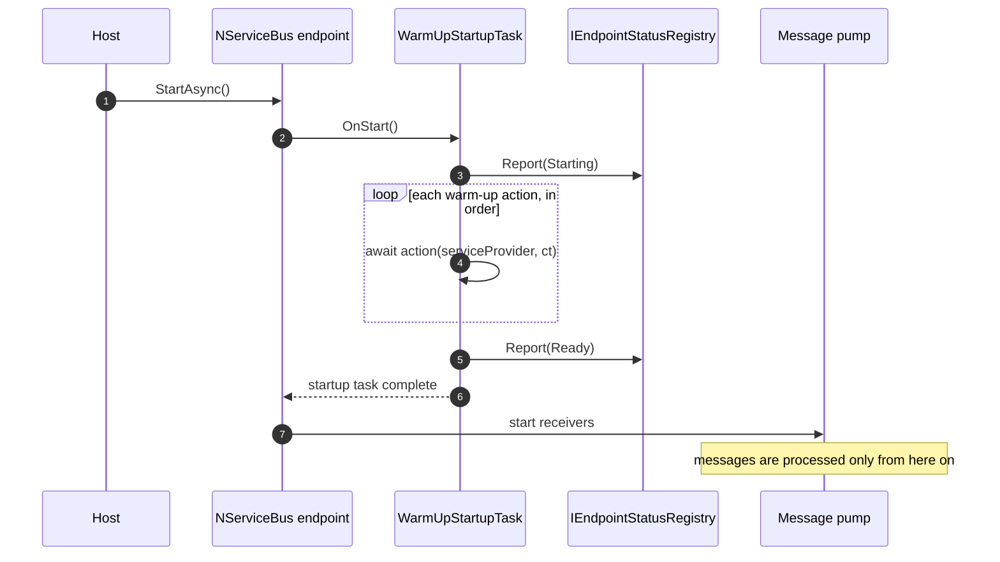
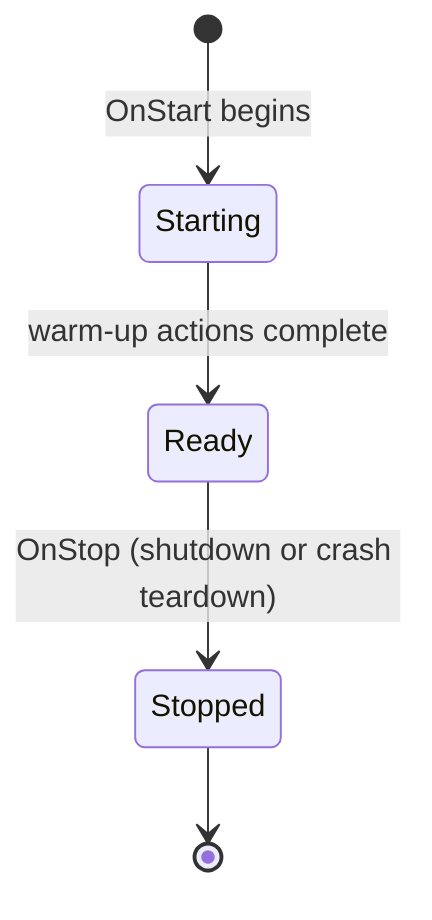

# NServiceBusContrib.WarmUp

Blocks message processing until user-defined warm-up actions complete, and tracks
each endpoint's readiness.

## Mechanism: warm-up before the pump

NServiceBus runs all `FeatureStartupTask`s during `Endpoint.Start`, and the
message pump only begins receiving **after** those tasks complete. That is the
canonical, per-endpoint hook to delay processing, and it works whether the
endpoint is hosted standalone or as one of many via `AddNServiceBusEndpoint`.

Warm-up is therefore a `Feature` that registers a `FeatureStartupTask`:



Actions run **sequentially in registration order**, so dependencies between them
are predictable. Any exception fails endpoint start (the pump never opens) —
warming up "half way" and then processing is worse than failing fast.

## Readiness states

The same startup task drives the endpoint's readiness in the registry. `Stopped`
covers a graceful shutdown **and** a crash: when NServiceBus tears an endpoint
down after a critical error, the feature's `OnStop` runs, flipping it out of
`Ready` — so a single faulted endpoint makes `/health` report unhealthy, without
the package overriding the user's critical-error action.



## API

Warm-up is configured per endpoint. `Run<T>()` resolves the task (and its
dependencies) from the endpoint's service provider, so there is no endpoint-name
string anywhere.

```csharp
var endpointConfiguration = new EndpointConfiguration("Sales");

endpointConfiguration.WarmUp(warmup =>
{
    // 1. simple lambda
    warmup.Run(async cancellationToken => await Cache.PrimeAsync(cancellationToken));

    // 2. lambda with access to the endpoint's IServiceProvider
    warmup.Run(async (services, cancellationToken) =>
    {
        var db = services.GetRequiredService<MyDbContext>();
        await db.Database.CanConnectAsync(cancellationToken);
    });

    // 3. a typed task resolved from DI
    warmup.Run<PrimeConnectionPoolTask>();
});
```

```csharp
public interface IWarmUpTask
{
    Task WarmUpAsync(CancellationToken cancellationToken);
}
```

`config.WarmUp()` (no argument) enables the feature without inline actions — useful
to opt an endpoint into readiness tracking only.

The single host-level call is `builder.Services.AddNServiceBusWarmUp()`, which
registers the `IEndpointStatusRegistry` (and a `TimeProvider`) that
NServiceBusContrib.HealthCheck reads. It takes no endpoint name.

## Enabling and assembly scanning

The warm-up `Feature` is enabled explicitly from `config.WarmUp(...)` via
`EnableFeature<WarmUpFeature>()` (the pattern NServiceBus 11 will require;
`EnableByDefault` is being retired). Because `EnableFeature<T>()` adds the feature
directly rather than relying on discovery, it works whether or not assembly
scanning is enabled — so multi-endpoint hosts (which disable scanning) are fully
supported. The trade-off is that warm-up is opt-in per endpoint: an endpoint that
never calls `config.WarmUp(...)` gets no warm-up and is not tracked for readiness.
